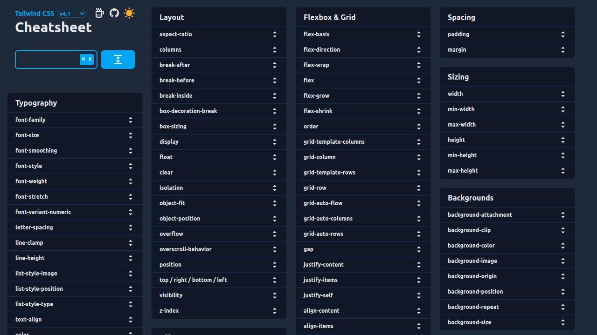

# Tailwind Cheatsheet

  

[Tailwind Cheatsheet](https://tailwindcss.504b.cc/) quick reference tool for Tailwind CSS classes.

## Features

- ⚡ Search and filter Tailwind CSS classes
- 🎯 Highlighting matched classes
- 🧩 Masonry grid layout for optimal use of screen space
- 🌓 Dark mode support
- 📋 One-Click copy to clipboard
- ⌨️ Keyboard shortcuts:
  - `⌘ K` (or `Ctrl K`) to focus search.
  - `Esc` to clear search and collapse all.

## Tech Stack

- **Framework**: [Next.js](https://nextjs.org/)
- **Styling**: [Tailwind CSS](https://tailwindcss.com/)
- **Layout**: [React Plock](https://github.com/valentinhuber/react-plock) (Masonry Grid)

 

> **Legacy Version**: Looking for the previous version built with SvelteKit? You can find it in the [`sveltekit`](https://github.com/pk504b/tailwind-cheatsheet/tree/sveltekit) branch.